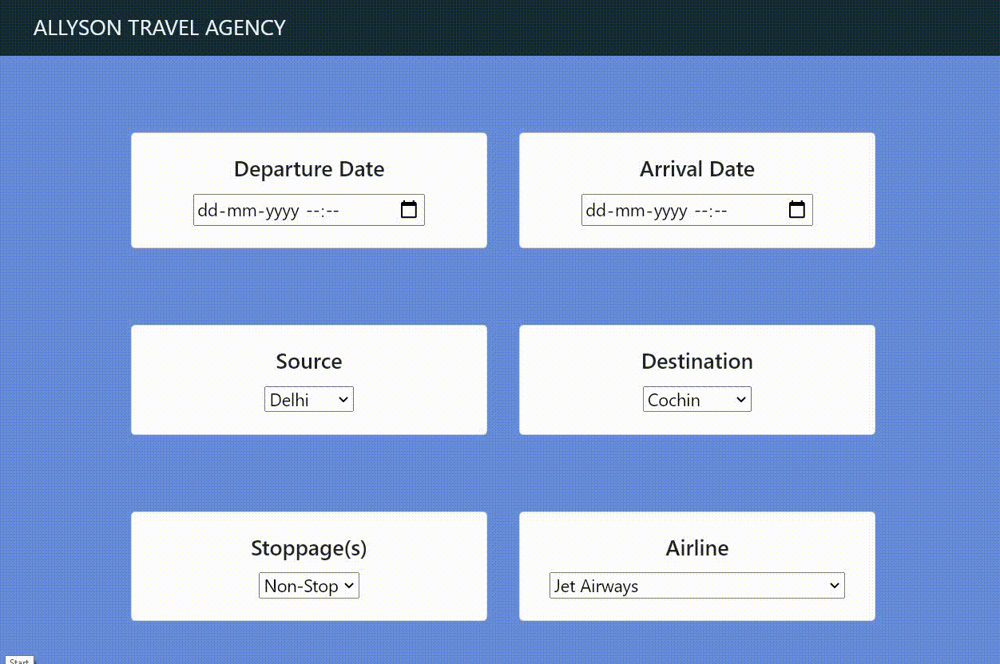

# Airline Flight Fare Prediction: 

This repository consists of files required for end to end implementation of Machine Learning Flight Fare Prediction web application created using  Flask as backend and Html,css as frontend.

## Table of Contents
  * [App Link](#app-link)
  * [About the App](#about-the-app)
  * [Technologies Used](#technologies-used)

## App Link
Working demo of the project 

A glimpse of the web app:

## About the App
The Airline Flight Fare Prediction is a Flask web application to predict airline flight fares across the Indian cities. The dataset for the project is taken from Kaggle, and it is a time-stamped dataset so, while building the model, extensive pre-processing was done on the dataset especially on the date-time columns to finally come up with a ML model which could effectively predict airline fares across various Indian Cities. 
The dataset had many features which had to pre-processed and transformed into new parameters for a cleaner and simple web application layout to predict the fares. The various independent features in the dataset were: 

Airline: The name of the airline.

Date_of_Journey: The date of the journey

Source: The source from which the service begins.

Destination: The destination where the service ends.

Route: The route taken by the flight to reach the destination.

Dep_Time: The time when the journey starts from the source.

Arrival_Time: Time of arrival at the destination.

Duration: Total duration of the flight.

Total_Stops: Total stops between the source and destination.

Additional_Info: Additional information about the flight

Price: The price of the ticket

## Technologies Used

 
    
    
    
    
     
     
      
     

